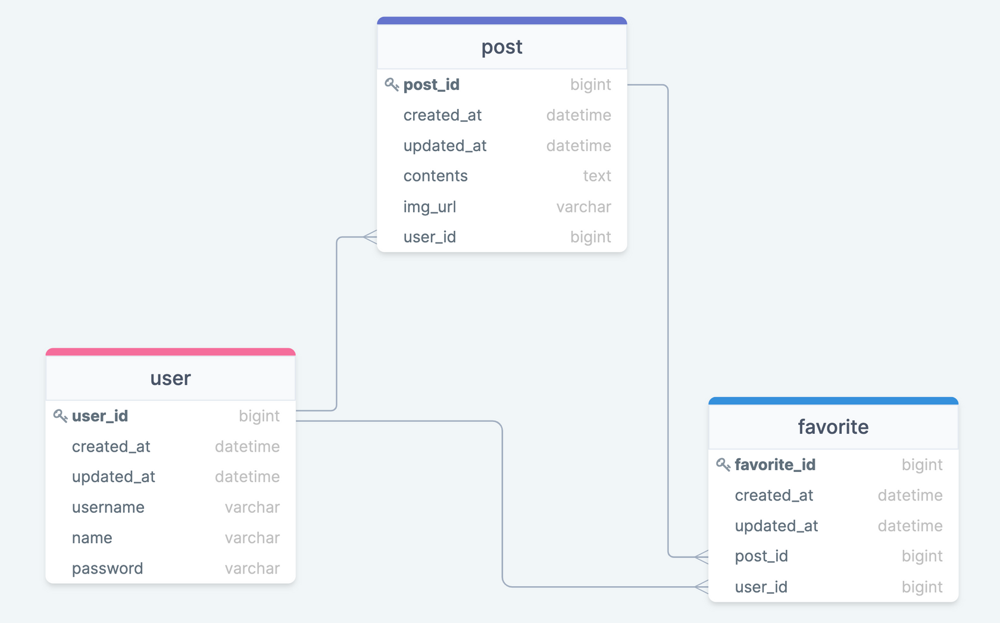

# hh99_magazine

    
    
    
    
    

### 개요

- 스프링 시큐리티에서 JWT를 이용한 인증 및 인가 구현
- 클라이언트와 서버간의 REST API 통신 구현

 

### 기간

- 2022.02.18 ~ 2021.03.02

 

### API

##### 게시글 (/api/posts)

| NO  |    URL     | METHOD |                BODY                 |    RETURN     |   DESC    |
|:---:|:----------:|:------:|:-----------------------------------:|:-------------:|:---------:|
|  1  |     /      |  GET   |                                     | (비로그인) 전체 게시글 | 전체 게시글 조회 |
|  2  |  /signed   |  GET   |                                     | (로그인) 전체 게시글  | 전체 게시글 조회 |
|  3  |     /      |  POST  |        name, title, content         |    게시글 정보     |  게시글 작성   |
|  5  |  /:postId  | PATCH  |        name, title, content         |    게시글 정보     |  게시글 수정   |
|  6  |  /:postId  | DELETE |                                     |      메세지      |  게시글 삭제   |  

##### 사용자 (/api)

| NO  |   URL   | METHOD |                   BODY                   | RETURN | DESC |
|:---:|:-------:|:------:|:----------------------------------------:|:------:|:----:|
|  1  | /signup |  POST  | username, name, password, check_password |  메세지   | 회원가입 |
|  2  | /signin |  POST  |            username, password            |  메세지   | 로그인  |

##### 좋아요 (/api/favorite)

| NO  |   URL    | METHOD | BODY | RETURN |  DESC  |
|:---:|:--------:|:------:|:----:|:------:|:------:|
|  1  | /:postId |  POST  |      | 게시글 정보 | 좋아요 토글 |

 

### Domain

 

### 문제 해결
- JWT 필터에서 토큰 유효성 예외 처리 문제 
  - 인증 엔트리 포인트를 생성하여 필터단에서 예외를 잡을 수 있게 설정함

- Cors 문제
  - WebConfig에서 설정 (일단 모든 요청 허용)

- 단방향? 양방향?